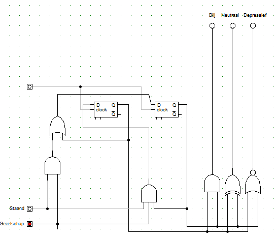

# Digital-Technology
Using Inter Integrated Circuit and HWlib to communicate with a PCF8574. The goal is to get a better understanding of I2C and the PCF8574 for future exercises. 
## Functionality
It's a finite state machine resembling a tamagotchi that's happy when it's standing up and he has company. Consequently, a tilt sensor and RCWL-0516 Radar Sensor (based on the Doppler Effect) are used. It beeps when it's not happy using a Passive Buzzer. Check it out [here](https://www.youtube.com/watch?v=RoL5wu19o3U).
## Logics
[]
